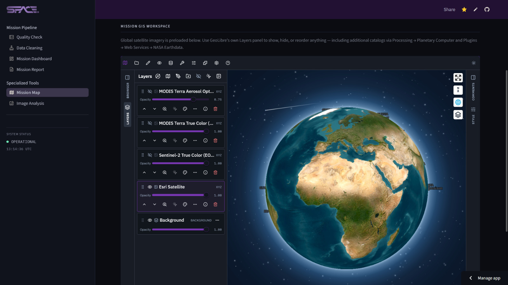

<div align="center">


# SpacePoint — Drone Remote Sensing & GIS Intelligence Pipeline

**End-to-end environmental monitoring platform: raw drone sensor logs → cleaned data → published GIS workspace → self-contained mission report, all inside one Streamlit app.**


[](https://geolibre.app)


**[Live Application](https://spacepoint-drone-pipeline.streamlit.app/) · [Report a bug](../../issues)**

━━━━━━━━━━━━━━━━━━━━ ✦ ━━━━━━━━━━━━━━━━━━━━

</div>

## 🛰️ At a Glance

- **Schema-agnostic pipeline** — works on any drone sensor CSV, no hardcoded column names
- **Real GIS integration** — GeoLibre workspace (not a static Folium embed): basemap switching, multi-source satellite imagery, genuine GeoJSON heat-surface layers
- **Custom bidirectional Streamlit Component** — flicker-free live map sync
- **Computer vision pipeline** — Excess Green Index + Otsu + K-means land cover, on a fixed physical scale for cross-image comparability
- **Resilient cloud publishing** — Supabase → JSONBin → static fallback chain
- **AI-assisted, human-reviewed reporting** — Gemini-drafted sections grounded strictly in mission data

<br/>

## 🛰️ Overview

Ingests raw sensor logs (temperature, humidity, pressure, light, air quality, GPS) from a drone-mounted payload and carries them through diagnostics, cleaning, dashboarding, GIS visualization, CV imagery analysis, and report generation — no script run outside the browser.

Sidebar is organized into **Mission Pipeline** (the sequential steps every mission passes through) and **Specialized Tools** (GIS workspace + image analyzer, usable independently at any point).

<br/>

<div align="center"></div>

<br/>

<div align="center">━━━━━━━━━━━━━━ ✦ ✧ ✦ ━━━━━━━━━━━━━━</div>

<br/>

## 🛰️ Application Pages

| Group | Page | What it does |
|---|---|---|
| Mission Pipeline | Quality Check | Read-only diagnostics — missing values, out-of-range, GPS loss, jumps, drift |
| Mission Pipeline | Data Cleaning | Interpolation, flagging, cleaned CSV/summary/GeoJSON output — no CLI required |
| Mission Pipeline | Mission Dashboard | Live sensor averages, charts, warnings, filterable/exportable table |
| Mission Pipeline | Mission Report | Self-contained downloadable HTML/PDF, optional Gemini-drafted sections |
| Specialized Tools | Mission Map | GeoLibre GIS workspace — satellite imagery, points, flight path, IDW heat surface |
| Specialized Tools | Image Analysis | CV pipeline — vegetation index, brightness index, K-means land cover |

<br/>

## 🛰️ Engineering Highlights

- **Column detection** identifies timestamp/GPS/sensor fields by name-fragment matching + numeric-ratio heuristic — same code path handles any payload
- **IDW heat surface** restricted to each cell's 10 nearest readings + local equirectangular distance correction, exported as real filled-contour GeoJSON polygons, not a flat raster
- **Live-sync bridge**: declared Streamlit Component wraps the GeoLibre iframe so it mounts once and only reloads on an actual mission/sensor change, never on unrelated reruns
- **CV thresholding** on fixed physical ranges (not each image's own min/max) so vegetation % is comparable across images and missions
- **Three-tier hosting fallback** for CORS-safe map publishing with automatic point thinning only when a free-tier size limit is hit

<br/>

## 🛰️ Tech Stack

| Layer | Tools |
|---|---|
| Application framework | Streamlit (`st.navigation`, session state, native caching) |
| Data processing | pandas, NumPy |
| Computer vision | OpenCV (ExG, Otsu, K-means), Pillow |
| GIS / mapping | GeoLibre, Leaflet.js, GeoJSON, OpenFreeMap, Esri, EOX Sentinel-2, NASA GIBS |
| Live map sync | Custom Streamlit Component (declared component + postMessage bridge) |
| Spatial interpolation | Custom k-NN IDW (NumPy) + equirectangular correction, Matplotlib contours |
| Cloud storage | Supabase Storage → JSONBin.io → Streamlit static (fallback chain) |
| Reporting | Jinja2, xhtml2pdf, base64 embedding |
| AI drafting | Google Gemini API (optional) |

<br/>

## 🛰️ Project Structure
```
dashboard/
├── Dashboard.py # Navigation router
├── branding.py # Theming
├── heat_interpolation.py # IDW + contour GeoJSON
├── image_processing.py # CV pipeline
├── geolibre_project.py # Project/layer builder + imagery catalog
├── geolibre_publish.py # Hosting fallback chain
├── components/geolibre_bridge/ # Live-sync Streamlit Component
├── pages/ # 6 pages, grouped by Dashboard.py
└── static/geo/ # Static GeoJSON fallback

scripts/ # column detection, cleaning, quality, report/pdf generation
data/ # raw / cleaned / geo / images / image_analysis
```


<br/>

## 🛰️ Getting Started

```bash
git clone https://github.com/ktariqq/spacepoint-drone-pipeline.git
cd spacepoint-drone-pipeline
pip install -r requirements.txt

# optional: generate sample missions
python scripts/generate_sample_data.py
python scripts/heat_island_sample.py

streamlit run dashboard/Dashboard.py
```

<br/>

## 🛰️ Configuration

All optional — the app degrades gracefully without any of them.

```toml
# .streamlit/secrets.toml
GEMINI_API_KEY = "your-key-here"          # AI-drafted report sections

SUPABASE_URL = "..."                       # GeoLibre map publishing (primary)
SUPABASE_SERVICE_KEY = "..."
SUPABASE_BUCKET = "geolibre-projects"

JSONBIN_MASTER_KEY = "..."                 # fallback if Supabase not configured
SPACEPOINT_DEBUG_MAP = true                # show GeoLibre connection details
```

<br/>

## 🛰️ Deployment

Live on **Streamlit Community Cloud**, entry point `dashboard/Dashboard.py`. To deploy your own: fork, connect in [Streamlit Community Cloud](https://streamlit.io/cloud), set `dashboard/Dashboard.py` as the main file, add secrets above under **Settings → Secrets**.

<br/>
<br/>

<div align="center">

━━━━━━━━━━━━━━ ✦ ✧ ✦ ━━━━━━━━━━━━━━

Built by **Kommal Tariq**

Copyright © 2026 SpacePoint. All rights reserved.

GIS workspace powered by [GeoLibre](https://geolibre.app), used under the MIT License.

</div>
